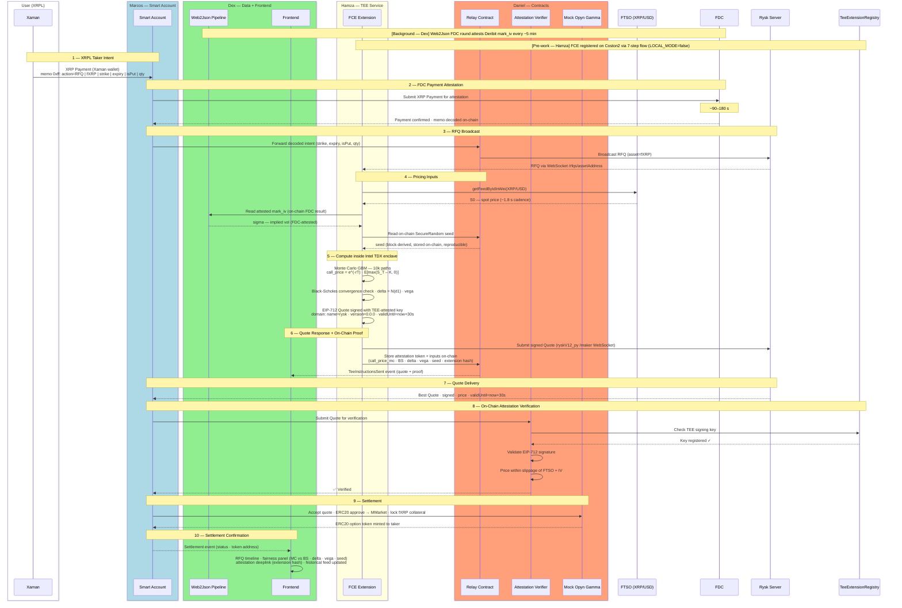

# sequence-diagram-detailed

```mermaid
sequenceDiagram
    box White User (XRPL)
        participant Xaman
    end
    box LightBlue Marcos — Smart Account
        participant SA as Smart Account
    end
    box LightGreen Dex — Data + Frontend
        participant W2J as Web2Json Pipeline
        participant FE as Frontend
    end
    box LightYellow Hamza — TEE Service
        participant TEE as FCE Extension
    end
    box LightSalmon Daniel — Contracts
        participant Relay as Relay Contract
        participant Verifier as Attestation Verifier
        participant Mock as Mock Opyn Gamma
    end

    participant FTSO as FTSO (XRP/USD)
    participant FDC as FDC
    participant Rysk as Rysk Server
    participant Registry as TeeExtensionRegistry

    Note over W2J,FDC: [Background — Dex] Web2Json FDC round attests Deribit mark_iv every ~5 min
    Note over TEE,Registry: [Pre-work — Hamza] FCE registered on Coston2 via 7-step flow (LOCAL_MODE=false)

    Note over Xaman,SA: 1 — XRPL Taker Intent
    Xaman->>SA: XRP Payment (Xaman wallet)<br/>memo 0xff: action=RFQ | fXRP | strike | expiry | isPut | qty

    Note over SA,FDC: 2 — FDC Payment Attestation
    SA->>FDC: Submit XRP Payment for attestation
    Note over FDC: ~90–180 s
    FDC-->>SA: Payment confirmed · memo decoded on-chain

    Note over SA,Rysk: 3 — RFQ Broadcast
    SA->>Relay: Forward decoded intent (strike, expiry, isPut, qty)
    Relay->>Rysk: Broadcast RFQ (asset=fXRP)
    Rysk-->>TEE: RFQ via WebSocket /rfqs/assetAddress

    Note over TEE,Relay: 4 — Pricing Inputs
    TEE->>FTSO: getFeedByIdInWei(XRP/USD)
    FTSO-->>TEE: S0 — spot price (~1.8 s cadence)
    TEE->>W2J: Read attested mark_iv (on-chain FDC result)
    W2J-->>TEE: sigma — implied vol (FDC-attested)
    TEE->>Relay: Read on-chain SecureRandom seed
    Relay-->>TEE: seed (block-derived, stored on-chain, reproducible)

    Note over TEE: 5 — Compute inside Intel TDX enclave
    TEE->>TEE: Monte Carlo GBM — 10k paths<br/>call_price = e^(-rT) · E[max(S_T – K, 0)]
    TEE->>TEE: Black-Scholes convergence check · delta = N(d1) · vega
    TEE->>TEE: EIP-712 Quote signed with TEE-attested key<br/>domain: name=rysk · version=0.0.0 · validUntil=now+30s

    Note over TEE,FE: 6 — Quote Response + On-Chain Proof
    TEE->>Rysk: Submit signed Quote (ryskV12_py /maker WebSocket)
    TEE->>Relay: Store attestation token + inputs on-chain<br/>(call_price_mc · BS · delta · vega · seed · extension hash)
    Relay-->>FE: TeeInstructionsSent event (quote + proof)

    Note over Rysk,SA: 7 — Quote Delivery
    Rysk-->>SA: Best Quote · signed · price · validUntil=now+30s

    Note over SA,Registry: 8 — On-Chain Attestation Verification
    SA->>Verifier: Submit Quote for verification
    Verifier->>Registry: Check TEE signing key
    Registry-->>Verifier: Key registered ✓
    Verifier->>Verifier: Validate EIP-712 signature
    Verifier->>Verifier: Price within slippage of FTSO + IV
    Verifier-->>SA: ✅ Verified

    Note over SA,Mock: 9 — Settlement
    SA->>Mock: Accept quote · ERC20 approve → MMarket · lock fXRP collateral
    Mock-->>SA: ERC20 option token minted to taker

    Note over SA,FE: 10 — Settlement Confirmation
    SA-->>FE: Settlement event (status · token address)
    FE->>FE: RFQ timeline · fairness panel (MC vs BS · delta · vega · seed)<br/>attestation deeplink (extension hash) · historical feed updated
```