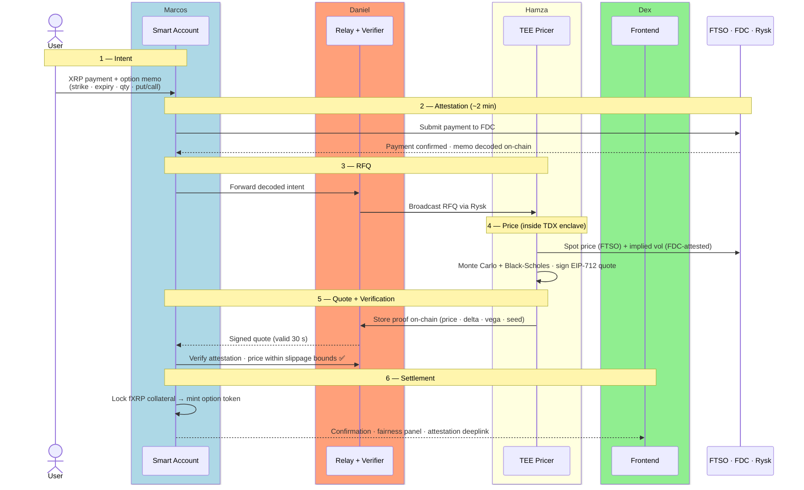

# sequence-diagram-overview

```mermaid
sequenceDiagram
    actor User
    box LightBlue Marcos
        participant SA as Smart Account
    end
    box LightSalmon Daniel
        participant Relay as Relay + Verifier
    end
    box LightYellow Hamza
        participant TEE as TEE Pricer
    end
    box LightGreen Dex
        participant FE as Frontend
    end
    participant Ext as FTSO · FDC · Rysk

    Note over User,SA: 1 — Intent
    User->>SA: XRP payment + option memo<br/>(strike · expiry · qty · put/call)

    Note over SA,Ext: 2 — Attestation  (~2 min)
    SA->>Ext: Submit payment to FDC
    Ext-->>SA: Payment confirmed · memo decoded on-chain

    Note over SA,TEE: 3 — RFQ
    SA->>Relay: Forward decoded intent
    Relay->>TEE: Broadcast RFQ via Rysk

    Note over TEE: 4 — Price  (inside TDX enclave)
    TEE->>Ext: Spot price (FTSO) + implied vol (FDC-attested)
    TEE->>TEE: Monte Carlo + Black-Scholes · sign EIP-712 quote

    Note over TEE,SA: 5 — Quote + Verification
    TEE->>Relay: Store proof on-chain (price · delta · vega · seed)
    Relay-->>SA: Signed quote (valid 30 s)
    SA->>Relay: Verify attestation · price within slippage bounds ✅

    Note over SA,FE: 6 — Settlement
    SA->>SA: Lock fXRP collateral → mint option token
    SA-->>FE: Confirmation · fairness panel · attestation deeplink
```